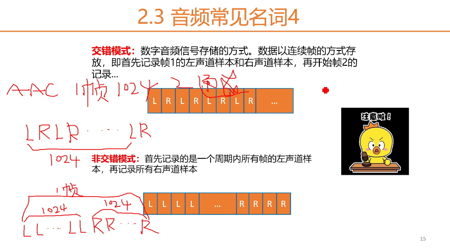

....
视频码率 kb/s
视频帧率 fps
视频分辨率
I帧、P帧、B帧


### 音频
hz 美秒周期数
次声 0-20hz 
人耳能听见的声音 20hz-20khz
超声波 20khz-1GHZ
特超声波 1GHz - 10THZ
Nyguist采样定律，采样频率至少是最高频率的两倍。
人耳[20hz-20khz],所以采样频率一般为44.1GHZ（采样频率）

一次采样，多少bit来量化(采样精度)？
16bit（-32768,32767）
通道数：单声道、双声道、四声道、5.1声道

比特率：单位bps，公式：
没有压缩的音频数据的比特率 = 采样频率 * 采样精度 * 通道数
码率：压缩后的音频数据的比特率。
码率=音频文件大小/时长
码率越大，压缩效率越低，印制越好，压缩后的数据越大。（个人理解:采样频率、采样精度都是固顶的）
压缩能缩小10倍

帧：每次编码的采样单元数
帧长：每帧播放的持续的时间。
AAC（Advanced Audio Coding），中文名：高级音频编码

交错模式和非交错模式：
通道的存储方式。
以双通道为例

图中的数字为样本数目，每个lr为一个样本

### 音频编码原理
码率：
```
2*44.1*16bit = 1.441Mbit/s
```
冗余：频谱掩蔽效应和时域掩蔽效应
频谱掩蔽效应：

 时域掩蔽效应：前掩蔽、同时域掩蔽、后掩蔽
 
 强信号掩蔽弱信号
音频编码-压缩编码的方法：

音频编码：OPUS、MP3、AAC（直播）、AC3和EAC3杜比公司的方案

### 封装格式
视频流、音频流、字幕
封装格式：MP4、flv、MKV、TS，
H264+AAC封装为FLV或者MP4是最为流行的模式
#### 音视频同步的概念
DTS：解码时间戳
PTS：显示时间戳，告诉播放器改在什么时候展示这一帧（音频和视频）的数据
同步的方式：
